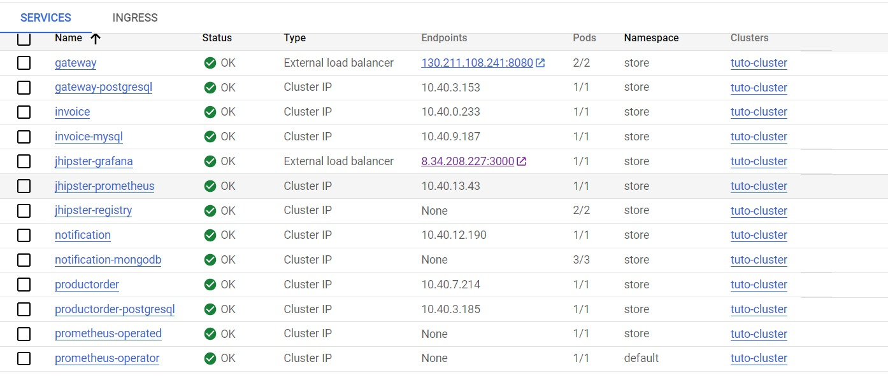
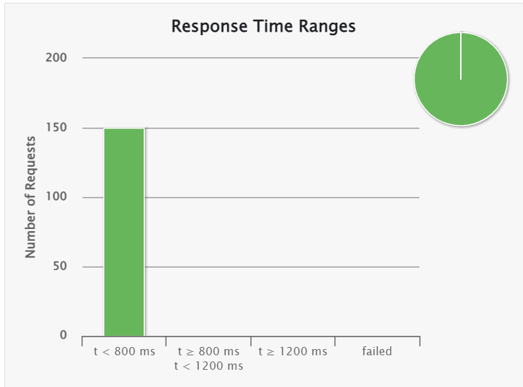
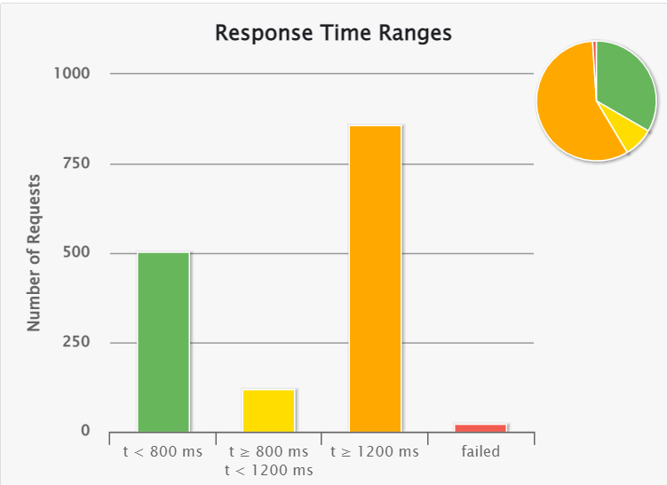
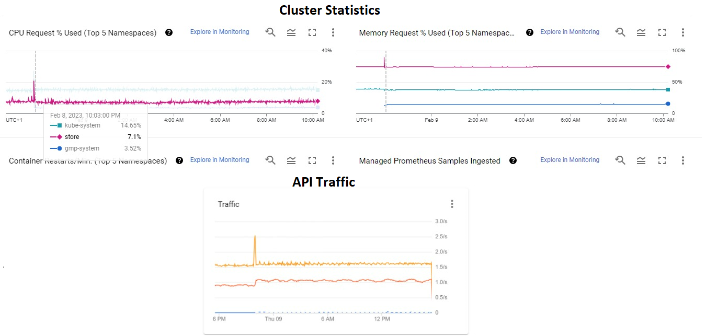
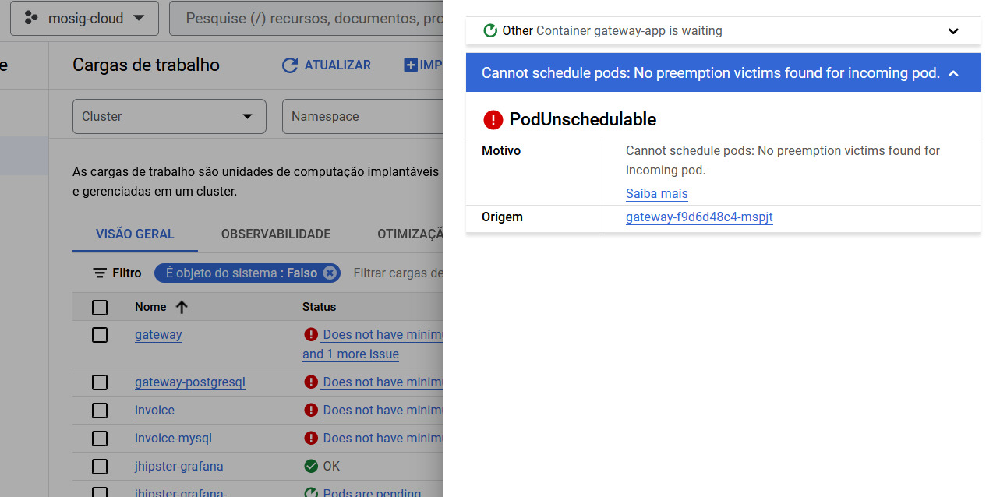

# Microservices Deployment
## Contents
- [Microservices Deployment](#microservices-deployment)
  - [Contents](#contents)
  - [Students](#students)
  - [Introduction](#introduction)
  - [Microservices Generation](#microservices-generation)
  - [Kubernetes Deployment](#kubernetes-deployment)
    - [1. Pushing the images to Docker Hub](#1-pushing-the-images-to-docker-hub)
    - [2. Cluster creation](#2-cluster-creation)
    - [3. Autoscaling definition](#3-autoscaling-definition)
    - [4. Services Deployment](#4-services-deployment)
  - [Load injection and monitoring](#load-injection-and-monitoring)
    - [1. Load injection](#1-load-injection)
    - [2. Monitoring](#2-monitoring)
  - [Conclusion](#conclusion)
- [Possible improvements for the tutorial](#possible-improvements-for-the-tutorial)
  - [Kubernetes Deployment](#kubernetes-deployment-1)
    - [1. Pushing the images to Docker Hub](#1-pushing-the-images-to-docker-hub-1)
    - [2. Cluster creation](#2-cluster-creation-1)
    - [3. Autoscaling definition](#3-autoscaling-definition-1)
    - [4. Services deployment](#4-services-deployment-1)
    - [5. Load injection](#5-load-injection)
    - [6. Monitoring](#6-monitoring)


## Students

Pedro Henrique PONS FIORENTIN - pedro-henrique.pons-fiorentin@grenoble-inp.org - 42102418 - Github: phpons 

Guilherme KLEIN KERN - guilherme.klein-kern@grenoble-inp.org - 42102675 - Github: guikk

Guilherme Akira ALVES DOS SANTOS - Guilherme-Akira.Alves-Dos-Santos@grenoble-inp.org - 42102741 - Github: gAkira

## Introduction
This report describes the steps taken and challenges faced to deploy the store microservices on Google Kubernetes Engine (GKE), following the tutorial provided by the professor Didier Donsez.

We have included a section in the end of the report with some of the errors we found on the way, in hopes that they can be used to improve the assignment for future students.

## Microservices Generation
All microservices were successfully generated with JHipster, and their respective images generated. 

Building the Docker images with the original command in the tutorial *"./gradlew -Pprod bootWar buildDocker -x test"* was not possible, therefore we referred to the monolith tutorial to find the correct command.

*Note: as of 2 weeks ago, the command has been fixed on the tutorial.*

## Kubernetes Deployment
### 1. Pushing the images to Docker Hub
All images were successfully pushed to Docker Hub by the members of the group.

### 2. Cluster creation
We used the following command to create the cluster:
```
gcloud container clusters create $CLUSTER_NAME --release-channel None --zone $COMPUTE_ZONE
```

### 3. Autoscaling definition
The standard cluster created in the above section cannot handle the full deployment of the microservices, resulting in a few pods not being scheduled. 

Therefore, the cluster was updated with the following parameters so it could adapt to the demand. The most important parameter here was "max_cpu".
```
gcloud container clusters update $CLUSTER_NAME \
	--zone $COMPUTE_ZONE \
    --enable-autoprovisioning \
    --min-cpu 1 \
    --min-memory 1 \
    --max-cpu 24 \
    --max-memory 64
```

### 4. Services Deployment
All services and monitoring stack were deployed to GCP with the command:
```
./kubectl-apply.sh -f
```
The live services can be seen in the image:
  
<p align = "center">
Fig. 1 - Live services on GCP
</p>

## Load injection and monitoring
### 1. Load injection
For the load injection and scalability tests we used Gatling to load the Gateway with multiple requests. The code we based ourselves on for this was obtained from this repository: https://github.com/jecklgamis/gatling-test-example

**Test 1 (10 requests/second):**
  
<p align = "center">
Fig. 2 - Response times for 10req/s test.
</p>

**Test 2 (100 requests/second):**
  
<p align = "center">
Fig. 3 - Response times for 100req/s test.
</p>

**Test 3 (500 requests/second):**
  
<p align = "center">
Fig. 4 - Response times for 500req/s test.
</p>

However, even with autoprovisioning enabled (which enables autoscaling), the gateway's performance doesn't seem to have improved during the load injection. From this, we infer that autoscaling was done at most in a low scale, but we could not identify why.

### 2. Monitoring
We could observe the cluster's resource usage spiking when the tests were performed. The screenshots were taken hours after the tests to guarantee that the spike was not a regular occurrence without the tests being executed.

We did not find a way to analyze individual metrics for services, so the statistics seen are on the cluster level.

  
<p align = "center">
Fig. 5 - GPC Dashboard.
</p>


## Conclusion
We generated a basic microservices architecture using JHipster. This architecture was then deployed on a GKE cluster, along with a monitoring stack; autoscaling was enabled for the cluster. Finally, the gateway was load tested using Gatling.

Monitoring the effects of load testing was done on the cluster level, future work could include obtaining metrics for the service and seeing how a single service scaled according to the load.


-----------------------------------
# Possible improvements for the tutorial
## Kubernetes Deployment
### 1. Pushing the images to Docker Hub
Instead of using "masteringmicroservice" as values in the code samples, it could be replaced by *YOUR_DOCKERHUB_ID_HERE*. 

This makes it clear for the student that the REPO variable should not be "materingmicroservice", which would result for them in a "access denied" error when trying to push to Docker Hub.

Proposed replacements:
```
> Username: masteringmicroservice

becomes

> Username: YOUR_DOCKERHUB_ID_HERE
```

and

```
REPO=masteringmicroservice

becomes

REPO=YOUR_DOCKERHUB_ID_HERE
```

### 2. Cluster creation
In our case, the standard cluster was not able to handle the whole deployment, so we had to enable autoprovisioning before having a working version of the stack.

Perhaps Terraform could be used to create a standard working cluster deployment so the tutorial is guaranteed to work for all students.

  
<p align = "center">
Fig. 6 - Gateway pods before enabling autoprovisioning.
</p>

### 3. Autoscaling definition
Some guidelines on what kind of autoscaling to set could be good to let the student focus on the effects of autoscaling when running the load injection, instead of first focusing on how to set up autoscaling without being sure of its correctness.

### 4. Services deployment
The standard *kubectl-apply.sh* produces this error for some of the deployments:
```
error: resource mapping not found for name: "gateway" namespace: "store" from "gateway-k8s/gateway-prometheus-sm.yml": no matches for kind "ServiceMonitor" in version "monitoring.coreos.com/v1"
```

To fix it, run the following command:
```
kubectl apply \
-f https://raw.githubusercontent.com/prometheus-operator/prometheus-operator/v0.52.0/example/prometheus-operator-crd/monitoring.coreos.com_prometheuses.yaml \
--force-conflicts=true \
--server-side
````

Also, replace "v1betav1 by "v1" in the Prometheus deployments:
```
rpl -i -w "v1betav1" "v1" monitoring-k8s/jhipster-prometheus-crd.yml monitoring-k8s/jhipster-prometheus-cr.yml
```

### 5. Load injection
A clear, independent, section on how to properly load inject with Gatling in GKE would have been helpful. 

Although we managed to run load injection, such a section would have saved the group a lot of time instead of having to rely on external resources for what should be a simple task.

### 6. Monitoring
The Grafana dashboard's credentials were not admin / admin. They were also not the ones seen in the .yml deployment for some reason.

By manually *exec*ing into the pods, we found out that the username was jhipster and we could manually change Grafana's password in order to log in.